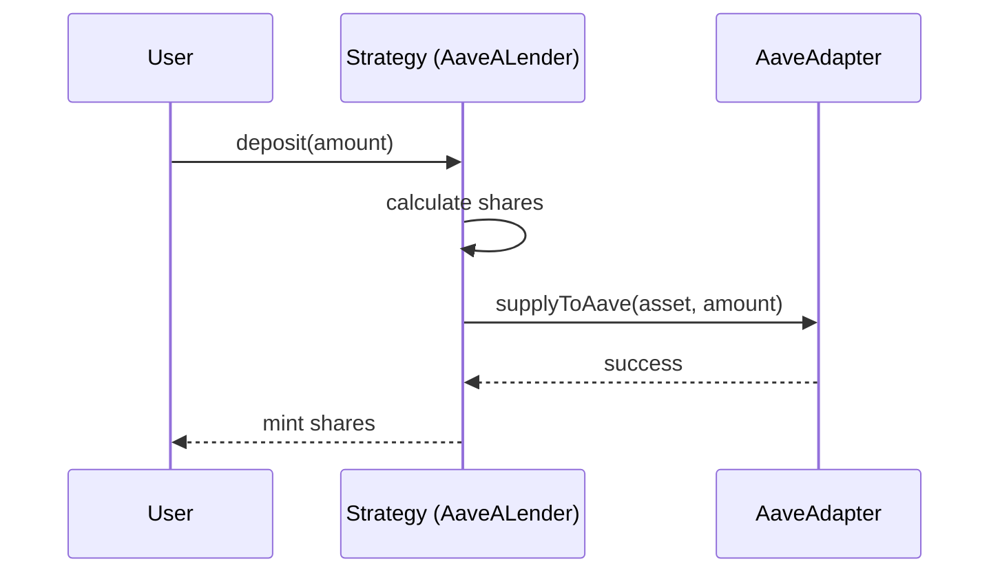
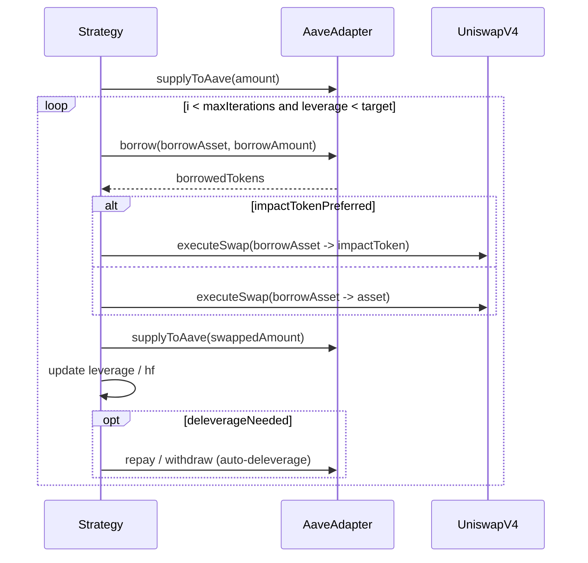
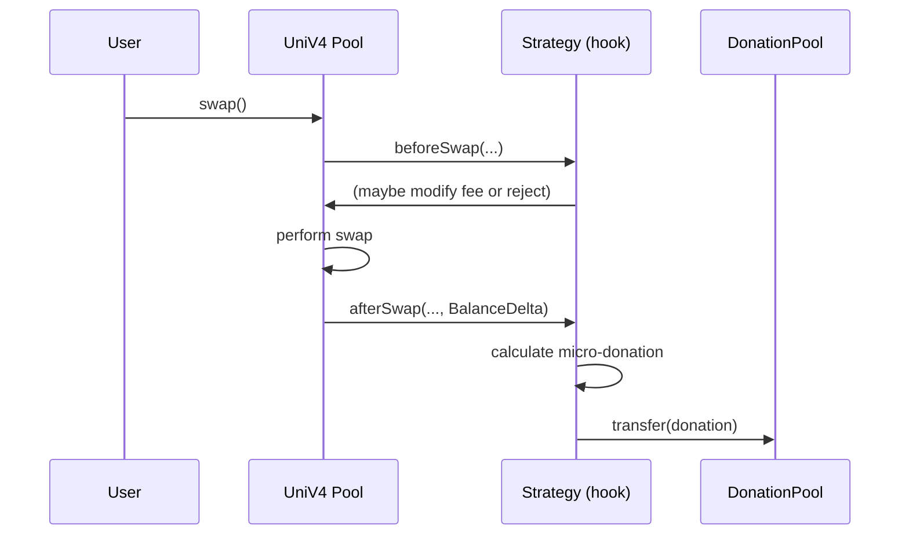

# /docs/architecture.md

# AaveALender.sol & AaveV4Leveraged.sol — Architecture & Implementation Guide

**Scope:** focused, engineer-grade architecture for the two strategy contracts:

* `AaveALender.sol` — *baseline Aave lender (ERC4626-style)*
* `AaveV4Leveraged.sol` — *leveraged looping strategy with Uniswap V4 integrations, ReFi features and protective guards*

Target audience: backend smart-contract engineers, integrators, auditors.

---

## 1. High-level summary

* **AaveALender** — Minimal, well-scoped tokenized strategy: deposit underlying, supply to Aave, withdraw, optional harvesting of incentive tokens (claim & convert to underlying). Typical invariants: TVL correctness, no leverage, bounded external calls.
* **AaveV4Leveraged** — Superset strategy that composes:

  * recursive leverage loops (borrow → swap/convert → re-supply) to amplify APY,
  * Uniswap V4 hook integration for swap/LP event-driven features (dynamic fee, micro-donate, anti-MEV checks),
  * ReFi primitives: donation routing, impact scoring, governance discounts,
  * defensive systems: health-factor monitoring, auto-deleverage, LP anti-flash protections.

This doc details responsibilities, call flows, data layout, invariants, attack surface, and tests for both contracts.

---

## 2. Glossary & assumptions

* `asset` — the underlying ERC-20 (e.g., USDC, WETH) used by both strategies.
* `aToken` — Aave interest-bearing token for `asset`.
* `lendingPool` / `IPool` — Aave V3 pool interface.
* `aaveAdapter` — abstraction used for supply/withdraw/claim to avoid duplicating low-level Aave logic.
* `OctantV2` / `GLOW_DISTRIBUTION_POOL` — on-chain destination for donations.
* `UniV4` hook points — `beforeSwap`, `afterSwap`, `beforeAddLiquidity`, `afterAddLiquidity`, `beforeRemoveLiquidity`, etc.
* `msg.sender` roles: `onlyManagement`, `onlyGovernance`, `onlyAdmin` — role checks already assumed.

Assume Aave V3 interfaces behave per Aave spec (reserve data, aToken incentives controller), and Uniswap V4 Hook interfaces behave like the contract excerpts shown in the code.

---

## 3. File map (implementation focus)

```
/contracts/
  ├─ strategies/
  │   ├─ AaveALender.sol
  │   └─ AaveV4Leveraged.sol
  ├─ adapters/
  │   └─ AaveAdapterV4Enhanced.sol
  ├─ interfaces/
  │   ├─ aaveV3/...
  │   └─ uniswapV4/...
  └─ modules/
      ├─ DonationRouter.sol
      └─ ImpactOracle.sol
```

---

## 4. Component responsibilities

### 4.1 AaveALender.sol

**Primary responsibilities**

* Implement `BaseStrategy` (ERC4626-like) functions:

  * `deposit(uint256) -> shares`
  * `withdraw(uint256 shares) -> assets`
  * `mint`, `redeem` as optional helpers
  * `totalAssets()`, `balanceOfAsset()`
* Supply assets to Aave via `aaveAdapter.supplyToAave(...)`
* Withdraw via `aaveAdapter.withdrawFromAave(...)`
* Optionally `harvest()` to claim `rewardsController` incentives and convert to `asset`.
* Approvals: safeApprove lendingPool and adapter.
* Events: Deposit/Withdraw/Harvest.

**Key invariants**

* `totalAssets()` must equal `aToken.balanceOf(self) + asset.balanceOf(self)` (subject to rounding).
* `deposit()` mints correct shares proportional to totalAssets pre/post.
* No direct external token transfer side effects other than those listed.
* No unbounded loops.

**Security considerations**

* Reentrancy: protect external calls with nonReentrant or checks-effects-interactions pattern.
* Slippage in reward swaps: use slippage bounds, price-oracle checks.
* Emergency rescue: `rescueTokens` (non-asset) to recover dust, gated to admin.

---

### 4.2 AaveV4Leveraged.sol

**Primary responsibilities**

* Full behaviour of `AaveALender` + leverage loops + Uniswap V4 hook logic + ReFi features.
* Core systems:

  * **Leverage Engine** — `_executeV4LeverageLoop()`: borrow asset or borrowAsset, swap to asset or impact token, re-supply, loop until `currentLeverage ≈ targetLeverage`.
  * **Adaptive Fee Engine** — `updateAdaptiveFees()` and helpers: calculate fee based on volatility and congestion, apply discounts.
  * **Donation-Verified Swap Engine** — `executeDonationVerifiedSwap()`: require prior donation verification and then perform swap with discount.
  * **Impact Oracle** — register impact tokens, query best impact token for operations.
  * **MicroDonationAutomation** — `triggerMicroDonation()` invoked by swap/loop operations.
  * **GovernanceRewards** — registration/score to produce fee and yield boosts.
  * **Anti-Flash LP Protections** — record LP deposit timestamps; enforce early-exit penalty.
  * **Uniswap V4 Hooks (if contract also acts as BaseHook)** — `beforeSwap`, `afterSwap`, `beforeAddLiquidity`, etc., implementing dynamic fee & protection logic.
* Use `AaveAdapterV4Enhanced` for atomic Aave operations, to reuse logic & enable adapter registration.

**Key invariants**

* `healthFactor` must remain ≥ `healthFactorEmergency` at all times (or auto-deleverage).
* `position.currentLeverage` should stay within `[minLeverage, maxLeverage]`.
* `totalAssets()` includes `aaveAdapter.getStrategyTotalValue()` and `_getV4LiquidityValue()`.
* `donation` accounting must be non-lossy: every outgoing donation must be tracked in `totalDonated` and `performance.totalPublicGoodsDonations`.

**Security considerations**

* Recursive borrowing loops present liquidation risk; loops must:

  * bound iterations (`leverageConfig.maxIterations`),
  * use conservative slippage/price oracles,
  * recalc health factor after each iteration and abort if approaching danger.
* External calls to Uniswap V4 (hook callbacks) are complex attack surface — ensure:

  * hooks are view-only where possible,
  * state changes are well-scoped,
  * untrusted data from pool is validated by TWAP/oracle.
* Donation-verified swaps must validate on-chain proof of donation; do not rely on off-chain signals.
* Randomness for selecting donation recipient uses blockhash — low-quality randomness but acceptable for non-financial weighting; better to keep deterministic or use verifiable randomness if stakes are high.
* Ensure `executeDonationVerifiedSwap` is `onlyManagement` (per code). If public, must design verification proof chain.

---

## 5. Data model / Storage layout (explicit)

Important: ordering & types matter for upgradeable vs non-upgradeable implementations. Below is a recommended flattened layout for non-proxy or UUPS-safe ordering.

### AaveALender.sol (example storage)

| Slot | Name               | Type               | Notes                   |
| ---- | ------------------ | ------------------ | ----------------------- |
| 0    | asset              | ERC20              | underlying              |
| 1    | aToken             | IAToken            | aave aToken             |
| 2    | lendingPool        | IPool              | Aave Pool               |
| 3    | aaveAdapter        | address            | adapter address         |
| 4    | rewardsController  | IRewardsController | incentives controller   |
| 5    | decimals           | uint8              | asset decimals          |
| 6    | totalShares        | uint256            | from ERC4626 base       |
| 7    | isVirtualAccActive | bool               | virtual accounting flag |
| ...  | —                  | —                  | —                       |

### AaveV4Leveraged.sol (recommended storage)

Group related fields to reduce SSTORE/R/W gas and to ease audits.

| Slot range | Group                 | Key fields (non-exhaustive)                                                                              |
| ---------- | --------------------- | -------------------------------------------------------------------------------------------------------- |
| 0-10       | Core references       | asset, aToken, lendingPool, aaveAdapter, rewardsController, decimals                                     |
| 11-30      | Leverage config       | leverageConfig.targetLeverage, min/max, healthFactorTarget/Emergency, autoLeverageEnabled, maxIterations |
| 31-60      | Position state        | position.totalSupplied, totalBorrowed, currentLeverage, lastRebalance, isLeveraged                       |
| 61-90      | Fee & micro-donation  | feeEngine.* (baseFeeBps, multipliers), microDonationEngine.*                                             |
| 91-120     | Impact & governance   | impactOracle mappings, governanceRewards struct fields                                                   |
| 121-160    | V4 liquidity tracking | activeLiquidityPositions array (struct: poolKey, ticks, liquidity, feesEarned)                           |
| 161-190    | Arbitrage & MEV       | arbitrageOpportunities mapping, mevProtection struct                                                     |
| 191-230    | Accounting & metrics  | performance struct, totalDonated, totalMicroDonations, adapterStrategyId                                 |
| ...        | —                     | —                                                                                                        |

**Storage notes**

* Use `mapping` for large variable sets (impactOracle.tokenImpactScores) — cheaper than arrays for updates.
* For arrays of structs (`activeLiquidityPositions`) ensure gas limits: add/remove should be optimized (swap-with-last removal).
* Avoid writing large arrays frequently in hot paths. Persist only necessary indices and deltas.

---

## 6. Control flows (sequence diagrams)

### 6.1 Deposit → Supply (AaveALender)



### 6.2 Leverage Loop (AaveV4Leveraged) — simplified



### 6.3 Hooked Swap (UniV4) -> Micro-donation + Fee Adjustment



---

## 7. API & developer surface

### Public functions (selected)

* `deposit(uint256 assets)` — standard
* `withdraw(uint256 shares)` — standard
* `harvest()` — claim rewards & reinvest/donate
* `setTargetLTV(uint256)` — governance
* `setDonationRate(uint256 bps)` — governance
* `executeDonationVerifiedSwap(...)` — management-only swap with donation precondition
* `updateAdaptiveFees()` — public callable, recalculates fees
* View: `getV4InnovationStatus()`, `getImpactTokenInfo(token)`, `balanceOfAsset()`

### Events (selected)

* `DonationVerifiedSwapExecuted(...)`
* `AdaptiveFeeUpdated(...)`
* `ImpactTokenRegistered(...)`
* `MicroDonationTriggered(...)`
* `DonationToOctant(...)`
* `V4SwapExecuted(...)`
* `AdapterIntegrated(...)`

---

## 8. Invariants & safety checks (audit checklist)

**AaveALender**

1. `totalAssets()` matches sum of on-chain balances.
2. `deposit()`/`withdraw()` share math reversible (no rounding exploit).
3. No arbitrary `transferFrom` by strategy (only user deposit flow).
4. Reward claim logic must check list of reward tokens & swap with slippage bounds.

**AaveV4Leveraged**

1. `position.currentLeverage` always within `[minLeverage, maxLeverage]` or an immediate emergency path triggers.
2. `healthFactor` never falls below `healthFactorEmergency`. If it does, `auto-deleverage()` must run.
3. `maxIterations` prevents infinite loop or gas exhaustion.
4. `executeDonationVerifiedSwap` must never allow double-spend of donation or bypass of verification.
5. `donation` transfers are accounted: sum(donations) ≤ `asset.balanceOf` change due to operations.
6. Uniswap V4 hook callbacks must have bounded gas usage and validate pool-provided data.
7. All external calls to adapters/pools implemented with `try/catch` or require checks to avoid silent failures.

---

## 9. Tests & QA plan (Foundry recommended)

### Unit tests (fast)

* AaveALender:

  * deposit / withdraw roundtrip
  * harvest: mock rewardsController with reward tokens and verify swap path & final balances
  * edge cases: deposit 0, withdraw > balance, reentrancy attempt
* AaveV4Leveraged:

  * configure small targetLeverage and perform loop; assert `position.currentLeverage` ~ `targetLeverage`
  * health factor drop simulation: ensure `auto-deleverage` triggers and reduces borrow
  * donationVerifiedSwap: simulate donation then swap; ensure swap only permitted after verified donation
  * microDonation trigger on swap & liquidity events
  * registerImpactToken: check impact-based routing logic

### Fork / Integration tests (slower)

* Fork mainnet (or testnets with Aave + UniV4) and run:

  * Full leverage loop with real Aave adapter (careful with funds — use impersonation)
  * Uniswap V4 hooks: simulated pool swaps with strategy acting as hook — assert micro-donation and fee changes
  * Reward harvesting flow: claim stkAave and swap through V4 route

### Fuzz tests

* Randomized deposits/withdraws with random loop counts, check invariants after each operation:

  * `totalAssets()` monotonic with deposits / withdraws except expected harvesting
  * `healthFactor` never under emergency threshold after each loop step

### Property-based tests

* For `deposit()` and `withdraw()`: shares vs assets conservations (roundtrip property)
* For fee updates: `updateAdaptiveFees()` must always produce fee in `[100,2000]` per clamp

---

## 10. Gas optimizations & considerations

* Use `storage` packing for small `uint16/uint32` fields together with booleans.
* Separate infrequently updated metrics (`performance.*`) to a secondary contract or `view` aggregator to reduce hot-path SSTORE.
* For arrays like `activeLiquidityPositions`, prefer push-only and mark-as-removed pattern to avoid gas on middle removals; recycle slots using an index mapping.
* Use `immutable` for contract addresses that never change (adapter, lendingPool, aToken), saves gas on reads.
* Cache `decimals` and `asset` in local `memory` variables in hot functions.
* Avoid loops over dynamically sized arrays in hot paths; if unavoidable, limit iterations.

---

## 11. Upgradeability & deployment notes

* If using proxy pattern:

  * Carefully manage storage layout: append-only model; map storage groups exactly as in section 5.
  * Migration scripts: provide `initializeV2()` that validates previous storage.
* If not using proxy:

  * Mark critical config functions `onlyManagement` and consider timelock for governance changes to `donationRate`, `targetLeverage`, `feeEngine.baseFeeBps`.
* Adapter registration: `_registerWithAdapter()` should be idempotent; require adapter to store `strategyId` or be easily replaceable.

---

## 12. Attack scenarios & mitigations (brief)

1. **Liquidation via oracle manipulation**:

   * Mitigation: TWAP checks, conservative LTV, emergency deleverage, oracle aggregation.

2. **MEV sandwiching on swap hooks**:

   * Mitigation: MEV protection time-locks, min/max swap sizes, slippage limits.

3. **Donation spoof / replay**:

   * Mitigation: donation verification window + on-chain proof (tx hash / merkle or on-chain receipt), non-reuse of `verifiedSwapHashes`.

4. **Flash LP attacks**:

   * Mitigation: `minLPDuration`, early-exit penalty, reward distribution to loyal LPs.

5. **Fee discount abuse (gov boost)**:

   * Mitigation: governance score calculation requires on-chain proof (votes, time-limited), whitelist.

6. **Reentrancy via router / adapter**:

   * Mitigation: nonReentrant modifier, checks-effects-interactions ordering, limit external calls.

7. **DoS by gas exhaustion**:

   * Mitigation: bounded loops, `maxIterations`, avoid iterating long arrays in single tx.

---

## 13. Monitoring & metrics to expose

* `totalDonated`, `microDonationCount`, `totalFeesSaved`
* `position.currentLeverage`, `position.healthFactor`, `lastRebalance`
* `activeLiquidityPositions.length`, `feesEarned` per position
* `userImpactScores` + `supporterCount`
* `adaptiveFeeRate`, `currentVolatilityMultiplier`, `currentCongestionMultiplier`

Expose via `view` functions and emit granular events for any significant state change (donations, rebalances, deleverages).

---

## 14. README / integration snippets (quick)

Example: deposit & loop (pseudo)

```js
// JS / Ethers
await aaveV4.connect(user).deposit(ethers.utils.parseUnits("1000", 6));
await aaveV4.connect(management).setTargetLTV(20000); // 2.0x
// trigger background leverage (could be public function)
await aaveV4.connect(management).executeLeverageIteration();
```

Harvest & donate

```js
await aaveV4.harvest(); // claims rewards, swaps via V4, donates a % to Octant
```

---

## 15. Next recommended deliverables (practical)

1. `contracts/test/` — Foundry tests:

   * `AaveALenderTest.t.sol`
   * `AaveV4LeveragedTest.t.sol` (unit + fuzz)
   * `AaveV4LeverageLoopFork.t.sol` (fork: scenario tests)
2. `docs/security.md` — detailed adversary models & mitigations (expand from §12)
3. `docs/storage-layout.md` — for upgradeable deployments (explicit slots)
4. `scripts/deploy.ts` — deterministic deployment & verification
5. `flows/mermaid/` — sequence diagrams for all major flows

---

## 16. Appendix — important formulas

**Leverage ratio (simple)**

```
leverage = totalSupplied / (totalSupplied - totalBorrowed)
```

**Post-loop health factor calculation (Aave style, simplified)**

```
HF = (collateral_value * liquidation_threshold) / borrowed_value
```

Ensure `HF >= healthFactorTarget` during normal ops and `HF >= healthFactorEmergency` as absolute minimum.

**Donation calculation**

```
donation = harvested * donationPercentage / 10000
microDonation = absoluteSwapProfit * microDonationBps / 10000
```

---

If you want, next I'll:

* produce the **concrete `storage-layout.md`** with exact slot numbers (for proxy upgrade safety), or
* generate the **Foundry test skeleton** for these contracts (unit + fork tests), or
* convert mermaid diagrams to PNG/SVG and embed in docs.

Which of those should I make next?
